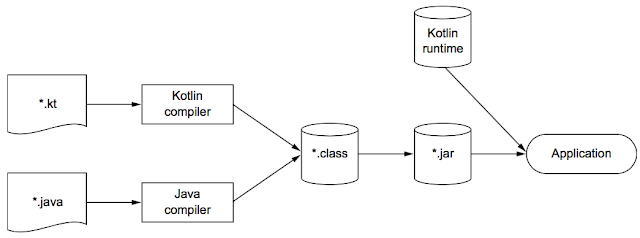

# 1장. 코틀린이란 무엇이며, 왜 필요한가?
* https://velog.io/@dbsdlswp/Kotlin%EC%9D%B4%EB%9E%80-%EB%AC%B4%EC%97%87%EC%9D%B4%EB%A9%B0-%EC%99%9C-%ED%95%84%EC%9A%94%ED%95%9C%EA%B0%80

## kotlin의 주요 특성
### 대상 플랫폼 : 서버, 안드로이드 등 자바가 실행되는 모든 곳
서버(백엔드) 및 안드로이드 등 자바가 실행되는 모든 플랫폼에서 동작하며, iOS 등에서도 동작한다.
* https://kotlinlang.org/docs/mpp-intro.html
* [KMM 을 통한 Android, iOS 간 코드 공유](https://myungpyo.medium.com/kmm-%EC%9D%84-%ED%86%B5%ED%95%9C-android-ios-%EA%B0%84-%EC%BD%94%EB%93%9C-%EA%B3%B5%EC%9C%A0-19f445c7231e)

### 정적 타입의 언어
자바와 마찬가지로 정적 타입 (statically typed) 언어이다. 

동적 타입의 언어의 경우 (ex> groovy) 이름이나 타입이 잘못 입력된 경우, 컴파일 시 걸러내지 못하고 런타임 시 오류가 발생하는데 

코틀린은 정적 타입의 언어이기 때문에 모든 프로그램의 구성 요소의 타입을 컴파일 시점에 알 수 있고, 동적 타입의 언어와 다르게 개발이 용이하다.

정적 타입 지정 언어의 장점은 아래와 같다.

- 성능 : 실행 시점에 어떤 메소드를 호출할지 알아내는 과정이 필요 없기 때문에 메소드 호출이 더 빠르다.
- 신뢰성 : 컴파일러가 프로그램의 정확성을 검증하기에, 실행 시 프로그램이 오류로 중단될 가능성이 적다.
- 유지 보수성
- 도구 지원

### 함수형 프로그래밍과 객체 지향 프로그래밍

프로그래밍의 패러다임은 절차지향, 객체지향, 함수형 프로그래밍으로 발전해왔다.

- 절차 지향 프로그래밍 (C, Cobol 등) : 초기의 프로그래밍 방식, 진행 순서(데이터 흐름)대로 프로그래밍하는 것이 특징, 순차적 처리가 특징
- 객체 지향 프로그래밍 (C++, Java 등) : 모든 데이터를 객체로 취급, 상속, 추상화 및 다형성 등으로 개발의 편의성을 꾀함 (재사용 등)
- 함수형 프로그래밍 (kotlin, switft, scala 등) : 함수 자체가 일급 객체가 되는 프로그래밍

#### 함수형 프로그래밍
* https://develaniper-devpage.tistory.com/92
* https://medium.com/@sket8993/kotlin-%ED%95%A8%EC%88%98%ED%98%95-%ED%94%84%EB%A1%9C%EA%B7%B8%EB%9E%98%EB%B0%8D-%EC%B4%88%EA%B0%84%EB%8B%A8-%EC%9D%B4%ED%95%B4%ED%95%98%EA%B8%B0-4dbf36dfc9a7
* https://mangkyu.tistory.com/111
##### 일급 객체 (First-class object)
함수 자체가 [일급 객체(First-class)](https://ko.wikipedia.org/wiki/%EC%9D%BC%EA%B8%89_%EA%B0%9D%EC%B2%B4)가 되는 프로그래밍이며, 일급 객체라함은...

1. 함수를 변수나 데이터로 할당할 수 있어야 하고,
2. 함수를 리턴할 수 있어야 하며,
3. 함수를 인자값으로 넘길 수 있어야 한다.

##### 불변성 (Immutability)
* https://readystory.tistory.com/105
불변성은 함수형 프로그래밍에서 가장 중요한 부분이며, Clojure, Haskell, F#과 같은 언어와 다르게 코틀린은 불변성이 강제되지는 않습니다. (순수 함수형 프로그래밍 언어가 아님)

불변성의 장점은 아래와 같습니다.

- 스레드 안전성(Thread-safe)
- 낮은 커플링(Loosely-coupling)
- 참조 투명성(Reference transparency)
- 컴파일러의 최적화
- 순수 함수

코틀린의 val은 불변성에 가까우나, 완전한 불변성을 보장하지는 않는다.

```kt
object MutableVal {
    var count = 0
    val myString: String = "mutable"
    get() {
        return "$field ${++count}"
    }
}
 
fun main(args: Array<String>) {
    println("first call ${MutableVal.myString}") // first call mutable 1
    println("second call ${MutableVal.myString}") // first call mutable 2
    println("third call ${MutableVal.myString}") // first call mutable 3
}
```

위의 코드의 MutableVal.myString은 val 타입이지만, 호출할 때 마다 다른 값을 출력하므로 완벽하게 불변성을 보장할 수 없다. (이 경우 const val을 사용하자.)

코틀린은 불변성을 권장하며, 가능한한 자동으로 불변을 제공하려 합니다. (ex> IDE에서 val로 변경하기를 권장함)
 
##### 부수 효과 (Side-effect) 없음
부수효과가 없는 [순수 함수](https://jeong-pro.tistory.com/23)를 1급 객체로 간주하여 파라미터로 넘기거나, 리턴 값으로 사용할 수 있어서 참조 투명성을 지킬 수 있고, 또한 테스트가 용이하다. 

#### 그렇다면 kotlin은?
위에서 언급한 것 처럼 코틀린은 함수형 프로그래밍의 특징을 갖고 있지만, 강제하고 있지는 않다. 예를들어, Immutable한 val과 Muttable한 var를 모두 제공하며, 객체 지향 프로그래밍도 가능하다.

## kotlin의 철학
### 실용성
코틀린은 연구를 위한 언어가 아니며, 다른 프로그래밍 언어가 채택한 검증된 해법과 기능에 의존하며, 또한 특정 프로그래밍의 스타일이나 패러다임을 사용할 것을 강제하지 않는다.

### 간결성
코드가 더 간단하고 간결하여 읽기 쉽다. getter, setter와 같은 보일러 플레이트 코드를 줄여주며, 표준 라이브러리로 다양한 확장 함수를 제공하여 간결성을 높여준다.

> 다만, 코틀린의 설계 목표에는 소스 코드를 가능한 짧게 만든다는 내용은 들어있지 않다.

### 안전성
정적 타입의 언어로서 타입 안정성을 보장하며, 기본적으로 NonNull 타입이고 Nullable한 타입의 경우 ?를 추가하여 사용할 수 있다. 이러한 설계는 갑자기 NullPointerException으로 크래시가 발생하는 경우를 줄여준다.

### 상호 운용성
자바 코드와 완벽하게 호환되며, 상호 운용이 가능하다. 자바에서 코틀린을 호출하거나, 코틀린에서 자바를 호출하는 경우에도 아무런 제약 없이 사용할 수 있다. 그리고, 코틀린은 자바 표준 라이브러리를 최대한 활용한다. (코틀린에는 자체 컬렉션 라이브러리가 없으며, 자바의 컬렉션에 추가 기능을 더하는 것 뿐이다.)

## kotlin의 빌드 과정

